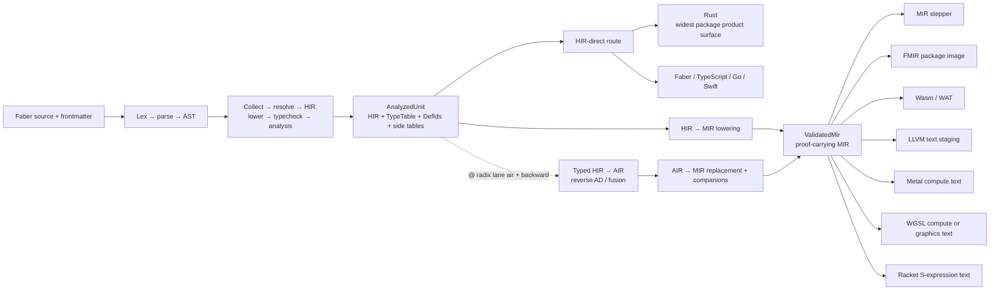
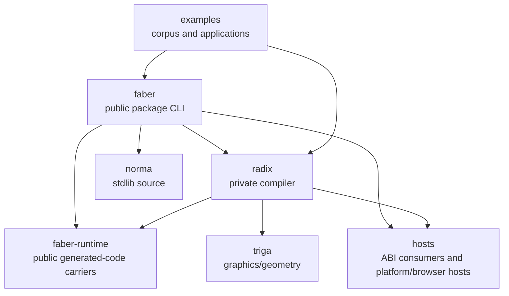
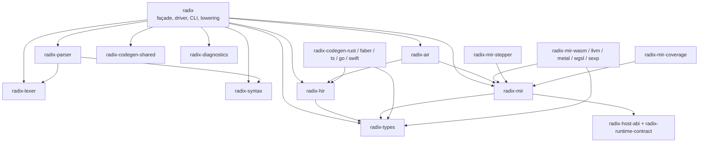
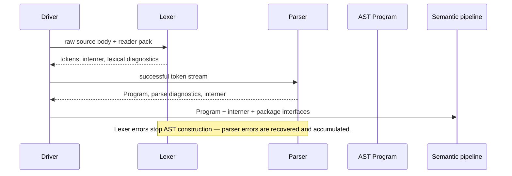
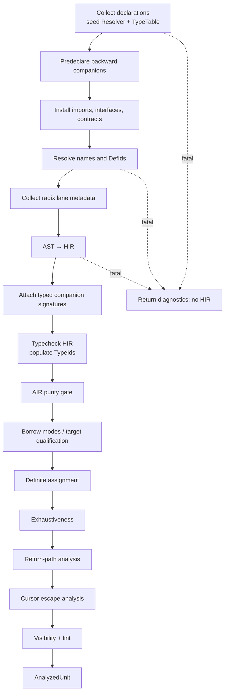
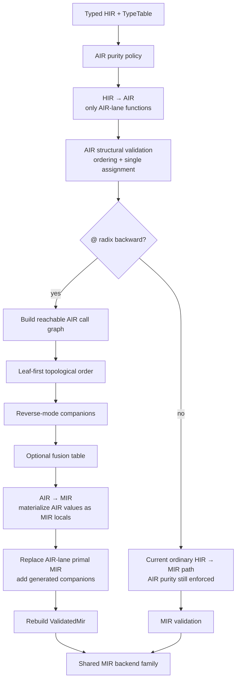
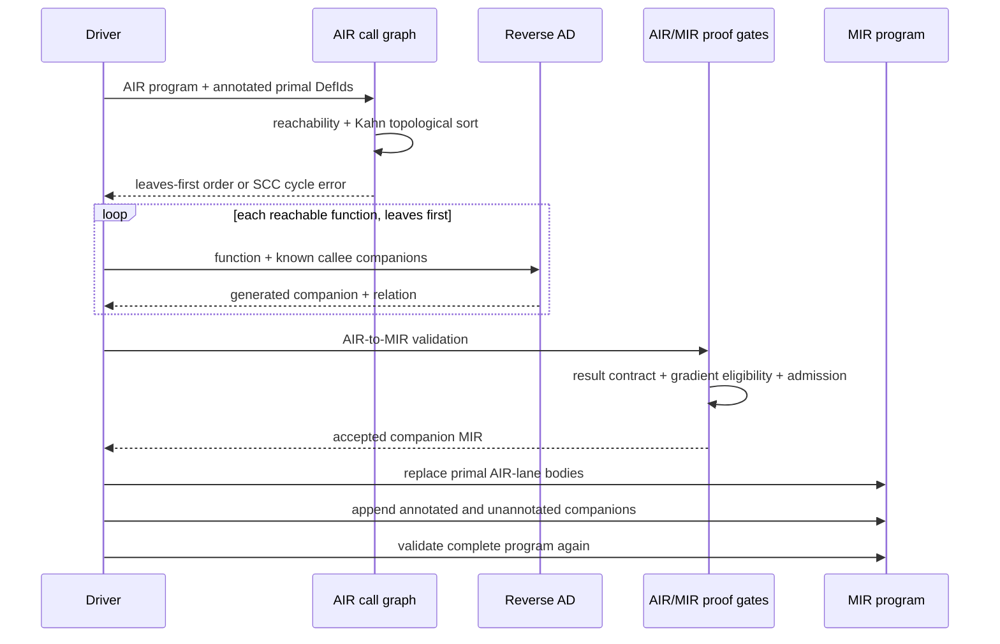
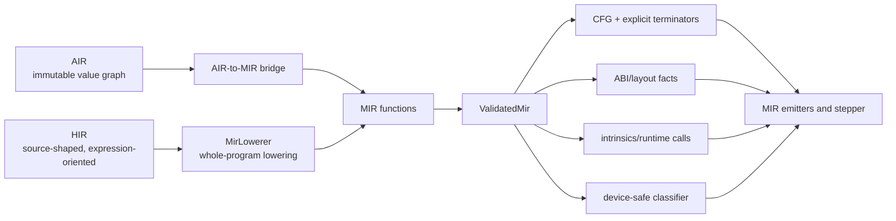
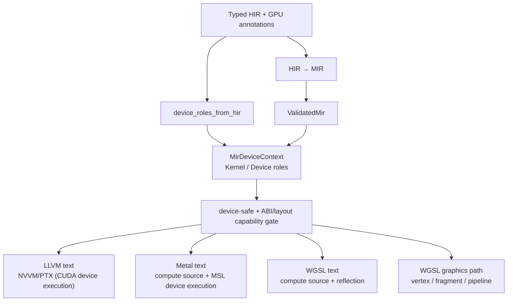
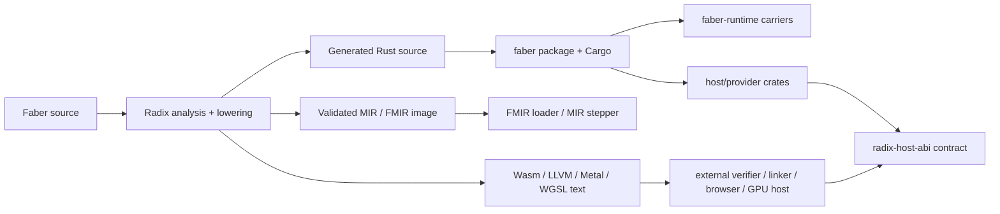

+++
title = "Inside Radix"
section = "toolchain"
order = 4
sources = [
  "radix/README.md",
  "radix/AGENTS.md",
  "radix/ARCHITECTURE.md",
]
+++

## Radix compiler

Radix is the Faber compiler. It is a private crate (`radix/`) that
implements the full compilation pipeline from source text to target
backends.

### Pipeline {#pipeline}

Radix lowers Faber source through three intermediate representations:

1. **HIR** (High-level IR) — the semantic core. Reader locale integration,
   type checking, and HIR-direct backends operate here.
2. **MIR** (Mid-level IR) — the execution-shaped IR. This is the semantic
   ownership boundary where borrowing and effect analysis run.
3. **AIR** (Autodiff IR) — a pure-functional transform for automatic
   differentiation and fusion, used by GPU target lanes.

### Target lanes {#target-lanes}

| Lane | IR | Output | Status |
|---|---|---|---|
| CPU runtime | MIR | FMIR (Rust runtime) | Shipping |
| LLVM | MIR | LLVM text | Experimental |
| Device execution | MIR | Metal MSL + CUDA PTX via `faber run --backend` | Active (reopened 2026-08-02) |
| WASM | MIR | WebAssembly text | Experimental |
| TypeScript | HIR | TypeScript source | Experimental |
| Go | HIR | Go source | Experimental |
| GPU/WGSL | AIR | WGSL via WGPU | Experimental |

### Architecture {#architecture}

Radix takes a text-emission approach rather than embedding LLVM. Target
backends produce text in their respective languages, which are then
compiled by the target's own toolchain. This keeps the compiler
self-contained and makes target output human-readable.

### Diagnostics {#diagnostics}

Radix emits structured diagnostic codes with stable identifiers:

- `LEX0xx` — lexer errors
- `PARSE0xx` — parser errors
- `SEM0xx` — semantic analysis errors
- `LOCALE0xx` — reader-locale fallback notices
- `DEFER0xx` — deferred features (valid syntax, not yet implemented)

Every diagnostic can be explained via `faber explain <code>`.

## Radix compiler architecture

**Repository:** `faberlang/radix`
**Reviewed:** 2026-08-05
**Compiler package:** `radix` 0.79.0

This document describes the Radix compiler as it exists in the source tree. It
is intended to be a source for diagrams, presentations, and implementation
orientation. It distinguishes three things that are easy to conflate:

1. the stable compiler contracts that downstream phases consume;
2. the current implementation of those contracts; and
3. target or research surfaces that deliberately stop at emitted text,
   validation, or proof rather than claiming a complete runtime.

The live Rust sources are authoritative when this document and an older design
note disagree. In particular, some AIR design documents predate the current
AIR lowering, reverse-mode companion generation, fusion, and proof-chain
implementation. The design notes remain useful for intent, but they are not a
status report.

### Executive model

Radix is a typed, source-preserving compiler with one shared frontend and two
main emission families:

- **HIR-direct / application lane:** preserve source-level structure and emit a
  language-shaped artifact. Rust currently offers the widest package
  product surface (build/run/test); Faber, TypeScript, Go, and Swift are
  HIR-facing emitters with narrower or rising measured surfaces. No target is
  the semantic center — HIR is.
- **MIR-backed / systems lane:** lower the same analyzed unit to an
  execution-shaped control-flow graph, validate it, and feed a stepper,
  package image, WebAssembly, LLVM text, Metal text, WGSL text, or a
  S-expression validation emitter.

AIR is not a third public backend. It is a pure-functional transform detour
for functions explicitly assigned to the AIR lane. It forks after typed HIR,
performs transformations such as reverse-mode automatic differentiation and
optional fusion, then rejoins MIR so the existing validator, ABI facts, and
backends remain the common downstream path.



The central design rule is that every route begins with one coherent semantic
snapshot. Backends must consume facts produced by earlier phases; they must
not re-resolve names, infer missing types, or silently choose a representation
for an unsupported target shape.

### Repository and ownership

The `radix` directory is the private compiler workspace. It is a workspace
container rather than the product package boundary. The user-facing package
tool is the sibling `faber` repository.



The package boundary is intentional:

- `radix` compiles one source unit and exposes phase-inspection commands. It
  does not own package discovery, import-graph assembly, standard-library
  binding, or generated Cargo layout.
- `faber` assembles packages, resolves manifests and imports, mounts standard
  library/provider interfaces, and owns `build`, `run`, `test`, and package
  artifact workflows.
- Generated Rust packages depend on the public `faber-runtime` crate, whose
  crate name is `faber`. They do not depend on the compiler itself.
- `radix-host-abi` describes emitted host contracts. The sibling `hosts`
  repository supplies native, provider, macOS, and browser products that load
  artifacts and answer those contracts.

Useful entry points:

- `crates/radix/src/lib.rs` — public compiler façade;
- `crates/radix/src/driver/mod.rs` — phase
  ordering and target dispatch;
- `crates/radix/src/tool/mod.rs` — developer
  CLI boundary;
- `../faber/README.md` — package/product boundary;
- `../faber-runtime/README.md` — generated Rust
  runtime boundary;
- `../hosts/README.md` — host products and libraries.

### Crate topology

The workspace is in the middle of a leaf-crate extraction. The package named
`radix` remains the façade and still owns cross-phase lowering that needs the
whole compiler context. The leaves own stable data models and target-specific
logic.



Ownership is deliberately asymmetric:

| Concern | Current owner | Boundary
| --- | --- | --- |
| Tokens, spans, interning, reader spelling | `radix-lexer` | raw source to tokens |
| Source-shaped AST | `radix-syntax` | tokens to untyped syntax |
| Predictive parser and recovery | `radix-parser` | tokens to `Program` |
| Semantic types, indices, widths, `DefId` | `radix-types` | type facts independent of HIR/codegen |
| HIR nodes and visitors | `radix-hir` | source-shaped semantic IR |
| AST→HIR lowering and semantic orchestration | `radix` | requires resolver, contracts, CLI, and full driver |
| AIR model, AD, fusion, proof records | `radix-air` | pure value graph and transforms |
| HIR→AIR and AIR→MIR bridges | `radix` plus the AIR bridge | requires the analyzed unit and MIR context |
| MIR nodes and validation | `radix-mir` | execution-shaped IR and proof wrapper |
| HIR-language emitters | `radix-codegen-*` | typed HIR to source artifact |
| MIR text emitters | `radix-mir-*` | validated MIR to target text/bytes |
| Package artifact assembly | sibling `faber` | package graph, FMIR image, Cargo layout |

The public `radix::*` modules re-export many leaves for path stability. A
re-export does not mean that the façade owns the data model.

### The frontend

#### Source loading and frontmatter

The driver starts by peeling raw source and frontmatter. A file frontmatter
locale can select a reader pack; otherwise the session pack or the Latin default
is used. The selected pack is threaded through lexing and semantic type
spelling so that input language vocabulary and output language vocabulary are
not accidentally mixed.

The source boundary also owns source-load diagnostics. It does not turn a
single-file compiler invocation into package discovery.

#### Lexer

The lexer is a single-pass, error-resilient boundary from UTF-8 source to
tokens. It owns:

- byte-offset spans into the original source;
- token and literal representation;
- symbol interning;
- keyword and reader-pack spelling policy;
- Unicode normalization for identifiers; and
- structured lexical errors, fallback notices, and spelling suggestions.

Identifiers are normalized for symbol lookup while literals and comments retain
source bytes as needed for diagnostics and re-emission. The lexer emits error
tokens and continues where it can. The parser owns grammar recovery. A lexical
error is terminal for AST construction in the driver: the driver reports it and
does not ask later phases to interpret a poisoned token stream.

Source: `crates/radix-lexer/src/lib.rs`.

#### Parser and AST

The parser is handwritten predictive recursive descent. It owns token
navigation, node-ID allocation, parser diagnostics, and recovery at statement
and block boundaries. It is split into declaration, statement, expression,
pattern, and type parsers.

The parser returns:

- an optional source-shaped `Program`;
- collected `ParseError`s; and
- the interner used by the parsed source unit.

Node IDs are allocated in parse order. They are useful for the current parse
and for attaching source facts, but they are not persistent source identities.
Definition identity is established later by name collection and resolution.

The syntax tree deliberately does not decide semantic questions. For example,
the type parser records the shape of `lista<T>`, function arrows, nullable
`T ∪ nihil`, and indexed collection syntax. It does not decide whether a name
exists, whether an index shape is valid, or whether a target can represent the
type. The expression parser handles precedence and postfix chains; statement
parsing keeps declaration/runtime control forms distinct.

Sources:

- `crates/radix-parser/src/lib.rs`;
- `crates/radix-syntax/src/lib.rs`;
- `crates/radix-syntax/src/ast.rs`; and
- `EBNF.md`.



### Semantic analysis and the analyzed snapshot

Semantic analysis is the contract between source-shaped syntax and all later
routes. It creates one `TypeTable`, one `Resolver`, and one identity space for
the source unit. The current canonical order is:

1. register builtins and reader-pack type spellings;
2. collect declarations and seed the resolver/type table;
3. predeclare `@ radix backward` companions so source calls can resolve;
4. install imported typed file interfaces and namespace exports;
5. validate kernel namespaces and import paths;
6. resolve names and definition identities;
7. collect `@ radix lane` and `@ radix backward` metadata;
8. collect local/imported annotation contracts and applications;
9. stop if collection, resolution, annotation, or import errors are fatal;
10. lower the resolved AST to HIR;
11. attach typed companion signatures before typechecking;
12. typecheck HIR and populate expression/local types;
13. enforce AIR purity for AIR-lane functions;
14. analyze target-neutral ownership modes, or legacy full borrow policy when
    explicitly requested;
15. run definite assignment;
16. run exhaustiveness;
17. run return-path analysis;
18. run live cursor escape analysis; and
19. run visibility checks and lints.

The driver applies target-specific syntax policy before semantic lowering for
the targets that require it, then applies the explicit Rust lifetime
qualification after the shared target-neutral snapshot is built. This keeps
Rust borrow/lifetime constraints from becoming accidental HIR semantics for
other targets.



#### Semantic type identity

`radix-types` owns the type model and must not depend on HIR, parser, or
codegen. A `TypeId` is meaningful only with its owning `TypeTable`. The table
contains primitive, aggregate, function, reference, option, union, indexed
shape, tensor, vector, matrix, sparse, atomic, and inferred/error forms.

Important distinctions:

- `T ∪ nihil` is normalized as an option type. `ignotum` is an ordinary
  semantic type and is not the same thing as a missing analysis fact.
- Indexed shapes use semantic index expressions and IDs. Shape and
  broadcasting questions belong above the HIR/MIR fork.
- HIR `TypeId` fields may be absent until typecheck has completed. Backends must
  reject missing facts rather than guess.
- MIR wraps a semantic `TypeId` in `MirType` and may add a `MirLayoutId` later.
  The semantic identity and the physical carrier are therefore separate
  dimensions.

Sources:

- `crates/radix-types/src/lib.rs`;
- `crates/radix-hir/src/nodes.rs`; and
- `crates/radix-mir/src/nodes.rs`.

#### HIR lowering

HIR is source-shaped but semantic-identity aware. AST→HIR lowering lives in
the façade because it needs the resolver, type table, reader pack, CLI mount,
annotation contracts, and source-unit policies.

The lowerer:

- preserves source spans and resolved `DefId`s;
- allocates synthetic IDs for locals, catches, patterns, and CLI bindings;
- moves top-level executable statements into an explicit or implicit HIR
  entry block;
- normalizes surface sugar without performing backend lowering;
- preserves source intent such as optional chains, non-null assertions,
  failable calls, control expressions, tensor operations, and annotations; and
- emits a typed lowering diagnostic plus a HIR `Error` node when it must
  continue structurally.

Most control forms remain expression-shaped in HIR. `si`, `dum`, `itera`,
`fac`, `elige`, and `discerne` are not yet MIR basic blocks. This is the key
reason HIR can serve several language-shaped backends and why MIR lowering is a
separate phase.

Sources:

- `crates/radix/src/hir/lower/mod.rs`;
- `crates/radix/src/hir/lower/expr.rs`;
- `crates/radix/src/hir/lower/stmt.rs`; and
- `crates/radix-hir/src/lib.rs`.

#### `AnalyzedUnit`

The driver packages the semantic result into `AnalyzedUnit`. It is a coherence
boundary, not just a convenience struct. Its fields come from one analysis
stamp and include:

- the HIR program;
- the owning `TypeTable`;
- the resolver and portable qualified identities;
- library/import provenance;
- annotation contracts and applications;
- function effect, capture, failable-call, and call facts;
- resolved-use indices;
- CLI entry metadata, when present;
- `RadixLaneMetadata`;
- GPU builtin identities;
- source-stage graphics facts; and
- diagnostics accumulated before codegen.

The HIR and MIR routes must consume these facts together. Mixing HIR from one
analysis with a type table, interner, or resolver from another source unit is a
compiler bug.

Source: `crates/radix/src/driver/mod.rs`,
the `AnalyzedUnit` definition and `analyzed_unit_from_semantic`.

### Lanes and route selection

There are two related meanings of “lane” in Radix:

1. the architectural application/systems split, which is primarily selected by
   the output target; and
2. the source-level `@ radix lane` metadata, which identifies functions that
   need special route policy.

The live semantic side table recognizes:

| Source metadata | Meaning | Current target rule |
| --- | --- | --- |
| `@ radix lane "hir-direct"` | HIR-shaped route marker | Does not by itself select a backend. The output target still controls dispatch. |
| `@ radix lane "mir"` | Function is intended for a MIR-backed route | Rejected on current HIR-direct targets. |
| `@ radix lane "air"` | Function must satisfy the pure AIR subset before AIR transforms | Rejected on current HIR-direct targets; accepted only on MIR-backed routes. |
| `@ radix backward "name"` | Generate a named reverse-mode companion | Valid only with `lane "air"`; companion is predeclared before resolve. |

The target policy is explicit in the driver: `air` and `mir` functions produce
an analysis diagnostic when the selected target is Rust, Faber, TypeScript,
Go, or Swift. The lane annotation is not a replacement for target selection;
the target still determines whether all functions go through HIR codegen or
MIR lowering.

#### HIR-direct route

The HIR-direct route is:

```text
AnalyzedUnit → reject HIR recovery nodes → target HIR emitter → source artifact
```

The shared codegen boundary refuses HIR that still contains recovery error
expressions. It then dispatches explicitly:

- Rust → `radix-codegen-rust`;
- Faber → canonical Faber pretty-printer/roundtrip emitter;
- TypeScript → `radix-codegen-ts`;
- Go → `radix-codegen-go`; and
- Swift → `radix-codegen-swift`.

The per-language emitters own naming, carrier, failable-call, and runtime
mapping policy. The shared layer does not impose one universal source-language
strategy.

Rust is currently the fullest **package** application path: package builds,
Cargo generation, `norma`, and the widest runtime contract among HIR-direct
emitters. That is a product-surface ranking, not a claim that program meaning
lives in Rust. The Rust emitter produces source; Cargo and the generated
package then perform native CPU compilation. There is no current `MIR → Rust`
probe used as a production alternative.

CLI source is a special HIR-level product. The driver analyzes CLI metadata
alongside the source unit and has runnable Rust generation plus a narrow Go
slice. Other targets reject runnable CLI code generation rather than pretending
that a text emitter is a complete CLI runtime.

#### MIR-backed route

The ordinary MIR route is:

```text
AnalyzedUnit
  → HIR → MIR lowering
  → MIR validation
  → ValidatedMir
  → target-specific emit/step/package surface
```

MIR lowering is whole-unit lowering. It builds function/signature maps,
struct/enum metadata, provider imports, closure environments,
monomorphization facts, and entry metadata before lowering individual bodies.
Each MIR block ends with exactly one terminator. Lowering fails closed when it
cannot preserve a required semantic or ABI fact.

MIR is the right place for target-independent execution shape:

- locals, temporaries, and explicit places;
- typed values and assignments;
- calls and runtime calls;
- aggregate construction and projections;
- explicit branches, switches, gotos, and error edges;
- `TryCall` for failable calls;
- async/generator flags;
- closures and captured environments;
- collection/tensor operations;
- device role/stage metadata; and
- backend layout and ABI handles.

The MIR validator checks IDs, local/temp/value references, types, call
signatures, aggregate and projection shape, option contracts, runtime
intrinsic policy, and CFG structure. It returns `ValidatedMir`, an immutable
proof wrapper that downstream probes require. Validation is not a second
semantic analyzer, borrow checker, or repair pass.

Sources:

- `crates/radix/src/mir/lower.rs`;
- `crates/radix-mir/src/nodes.rs`; and
- `crates/radix-mir/src/validate.rs`.

#### AIR detour

AIR is a pure-functional value graph. Its functions contain ordered immutable
bindings. Each expression consumes parameters or values bound earlier in the
same block. AIR can represent nested expression blocks, `if`, and `match`, but
it does not own a CFG, runtime ABI, target layout, or independent typechecker.

The current AIR path is:

```text
typed HIR
  → AIR purity gate
  → HIR → AIR for `@ radix lane "air"` functions
  → AIR structural validation
  → reverse AD / call-graph companion generation (when requested)
  → optional fusion
  → AIR → MIR
  → MIR proof and backend
```

The ordinary MIR lowerer remains the complete-program path. In the current
driver, the AIR representation is materialized and installed in the explicit
backward-companion path. If an AIR-lane function has no `@ radix backward`
annotation, it still must pass AIR purity, but a MIR target can complete through
ordinary HIR→MIR lowering. This is an important implementation detail: AIR is
an available transform route, not a standalone `Target::Air` and not currently
an unconditional replacement for the general MIR lowerer.



##### AIR purity and lowering

The purity checker runs after HIR lowering and typecheck, consuming lane
metadata and typed HIR rather than re-parsing annotations. The accepted subset
rejects effects and mutation such as async/generator functions, kernel/device
functions, CLI mounts, mutable locals, assignment, loops, input/output,
panic/throw/recovery, closures, references, runtime conversions, and
expression-level AD. Calls must target another AIR-lane function. Tensor method
calls are admitted only for recognized, typed tensor receivers.

The HIR→AIR lowerer preserves resolved IDs, spans, and semantic `TypeId`s. It
turns source locals and expressions into immutable bindings and rejects
unsupported forms instead of inventing an AIR approximation.

Sources:

- `crates/radix/src/semantic/passes/air_purity.rs`;
- `crates/radix/src/air/lower.rs`; and
- `crates/radix-air/src/nodes.rs`.

##### Reverse-mode companions and cycles

`@ radix backward "name"` is a source-level request for a generated companion.
Companion names are predeclared before normal resolution. Companion IDs use a
high-bit partition so generated identities remain distinct from ordinary
source definitions.

The call-graph generator:

1. finds AIR calls reachable from annotated primal functions;
2. builds a callee-to-caller dependency graph;
3. topologically orders it leaves first;
4. generates unannotated callee companions on demand;
5. passes known callee companion information into each caller transform; and
6. rejects strongly connected components rather than attempting reverse AD over
   recursive cycles.

The reverse transform is a typed AIR transform. Its companion ABI is shaped as
`callee_primal_parameters, residual, upstream → gradient_tuple`. The driver
then validates the generated AIR→MIR result, checks the typed backward result
contract, admits the proof chain, installs the generated MIR functions, and
revalidates the complete MIR program.



##### Fusion

Fusion is optional and controlled by the driver’s `no_fuse` option. The fusion
pass records a `FusionTable` over AIR values. AIR→MIR consults that table: only
the root of a fused group is emitted as a distinct computation, while absorbed
intermediates remain addressable to the root’s operand mapping. Backends do not
need to understand AIR fusion; they see the resulting MIR.

Fusion is a transform optimization, not a target contract. A target must still
validate the final MIR and its own device/layout capability.

### MIR as the convergence layer

MIR is deliberately more operational than HIR and less target-specific than a
particular source language or GPU ISA. It is the convergence layer for systems
targets.



#### MIR nodes

At a high level, a `MirProgram` contains functions. A `MirFunction` contains
parameters, locals, temporaries, blocks, return/error types, async/generator
flags, and an optional shader stage. A `MirBlock` contains statements and one
terminator.

Statements include assignment, direct calls, runtime calls, and aggregate
construction. Values include operands, closures, unary/binary computation,
option operations, conversions, collection operations, tensor operations, and
gradient operations. Places model assignable storage and projections.

Terminators own control flow. They include return, error return, `TryCall`
with success/error edges, goto, branch, switch, and unreachable. This makes
error propagation and CFG structure explicit for Wasm/LLVM/device probes.

#### MIR types and layouts

`MirType` carries a semantic `TypeId` and an optional layout handle. The
target-neutral MIR layout table can describe:

- scalar layouts such as integer, floating, and boolean widths;
- physical aggregates and opaque runtime handles;
- device vectors and matrices;
- atomic layouts;
- packed numeric descriptors; and
- tensor/device views with element type, rank, storage, locus, view kind,
  offset, contiguity, row-major status, and stride.

This separation is essential for GPU work. Semantic shape and element rules are
checked before the fork. Physical representation, host-owned versus
device-handle storage, register-class vector/matrix layouts, and kernel ABI
eligibility are checked in MIR/device policy.

#### Validation and fail-closed behavior

`ValidatedMir` is the required handoff token. A backend receives validated MIR,
not arbitrary nodes. The validator accumulates structural errors but does not
repair them. Target emitters add a second capability gate for target-specific
shapes and return a structured rejection when a shape is outside their support
floor.

This layering prevents a target from accidentally turning a semantic recovery
node, unresolved type, missing ABI fact, host-only value, or unsupported runtime
call into plausible-looking output.

#### Stepper and FMIR

The MIR stepper is a MIR-native reference/diagnostic executor. It interprets
validated MIR in-process and dispatches the same MIR intrinsics directly,
without emitting and instantiating a target module. `faber run` uses it for the
single-file interpret path.

FMIR is the source-independent package MIR image family. `fmir-text`, `fmir`,
and `fmir-bin` share one internal package image model and execute through the
FMIR loader/stepper in the `faber` package workflow. They are not emitted as
package images by the developer `radix` command. `scena` is a hidden legacy
source-backed package runtime surface.

The stepper is the reference for MIR-native execution behavior in the systems
lane. Rust remains the behavioral reference for the full application/runtime
surface.

Sources:

- `crates/radix-mir-stepper/src/lib.rs`;
- `crates/radix/src/mir/stepper/mod.rs`; and
- `docs/design/target-capability-matrix.md`.

### CPU, WebAssembly, LLVM, and GPU architectures

The phrase “CPU backend” needs care in Radix. The current product CPU route is
not `HIR → MIR → LLVM`. It is:

```text
Faber → typed HIR → Rust source → generated Cargo package → native Rust/CPU toolchain
```

MIR has additional systems targets that can eventually support CPU or device
execution, but the current LLVM target is textual staging rather than native
object generation.

#### Rust application/CPU route

Rust is the full HIR-direct emitter. It maps HIR semantic facts to Rust
source, uses `faber-runtime` carriers and provider modules, and preserves the
package/runtime contract expected by `faber build`. Cargo, rustc, and the
generated package own the final native CPU compilation.

This route intentionally does not lower MIR back into Rust. The compiler has
one source-shaped application emitter and one execution-shaped systems family,
rather than two competing production CPU paths.

#### WebAssembly route

`wasm-text` and `wasm` lower validated MIR to a deliberately small WAT/binary
surface. The emitter declares imports for compiler-owned `faber_*` runtime and
host contracts and fails closed on unsupported MIR shapes. The binary path
uses the same MIR-oriented model rather than being a separate semantic
compiler.

Radix emits the artifact; it does not claim that `faber run` or package
workflows execute it. A host/component runtime must supply the imports and
perform any external validation or instantiation. The sibling `hosts` products
are where those host responsibilities live.

Source entry points:

- `crates/radix-mir-wasm/src/lib.rs`;
- `crates/radix/src/mir/wasm_text/mod.rs`;
- `crates/radix/src/mir/wasm_binary.rs`; and
- `docs/wasm-execution-plan.md`.

#### LLVM text route

`llvm-text` is a MIR-backed LLVM IR probe/staging target. It performs:

1. HIR→MIR lowering;
2. MIR validation;
3. capability classification;
4. device-role classification when HIR carries kernel/device roles; and
5. textual LLVM emission for the admitted subset.

The current implementation does not link a local LLVM installation, produce
native object code, or own a package runtime. External LLVM tooling can verify
or link emitted text. The same NVVM/PTX staging chain is now live as the CUDA
device-execution lane: `faber run --backend cuda` emits NVVM/PTX device
artifacts and launches real CUDA kernels (e.g. RTX 5070) through the sibling
`faber` package pipeline.

Source: `crates/radix-mir-llvm/src/lib.rs`.

#### GPU route: one MIR, several device emitters

GPU lowering begins with the same frontend and semantic type facts. The GPU
fork is not a separate parser or typechecker:



The shared `MirDeviceContext` maps HIR function identities to `Kernel` or
`Device` roles. The device-safe classifier rejects shapes such as:

- unresolved/error types;
- host text/JSON/regex/value carriers in device positions;
- missing device vector/matrix/view layouts;
- host tensor storage where a device handle is required;
- opaque aggregate layouts;
- async/generator or failable device functions;
- unsupported device calls and runtime calls;
- host-style place projections; and
- unadmitted control-flow forms.

The classifier is conservative and target-entry aware. Kernel entry tensors may
be host-owned when the explicit kernel ABI knows how to expose them; device
functions and internal operations remain subject to stricter storage/locus
rules. This is why device roles, layouts, ABI facts, and reflection are all
MIR-side concepts.

##### Metal text

`metal-text` emits fail-closed Metal Shading Language compute source for kernel
functions. It derives a storage-buffer kernel signature, emits source, and
returns reflection describing the kernel resources. It is not a metallib
builder or a standalone launch runtime — device execution runs through the
sibling `faber` pipeline (`faber run --backend metal`, real MSL on Apple
Silicon, campaign reopened 2026-08-02).

Source: `crates/radix-mir-metal/src/lib.rs`.

##### WGSL compute text

`wgsl-text` emits fail-closed WGSL compute source and a reflection sidecar. It
derives kernel signatures and resource bindings from validated MIR and device
layout facts. External `naga` validation is the intended text-validation gate.
It is not a browser/WebGPU launch path or package runtime.

Source: `crates/radix-mir-wgsl/src/lib.rs`.

##### WGSL graphics path

Graphics is a special source-owned path inside the WGSL target. Before codegen,
the driver collects `GraphicsSourceFacts` for `@ vertex`, `@ fragment`, Triga
vertex layouts, varyings, fragment outputs, pipelines, and resource bindings.

When the source has vertex or fragment entries, the driver:

1. retains only shader entry functions for graphics MIR lowering;
2. lowers non-empty source-owned bodies through MIR;
3. treats a failed non-empty body lowering as a diagnostic rather than silently
   replacing the body with a scaffold;
4. permits empty bodies to use reflection-driven contract emission; and
5. emits WGSL source plus GPU reflection for the stage or combined pipeline.

This path is still MIR-backed: source-owned body semantics flow through MIR,
while stage interface facts come from the graphics side tables. It is not the
same path as a generic `@ nucleum` compute kernel.

Relevant driver code is in
`crates/radix/src/driver/mod.rs`, in
`generate_wgsl_text_output` and the graphics output helpers.

#### Racket S-expression route

`sexp` is a MIR-backed validation/emission surface that emits runnable Racket
for a bounded subset. It is useful for compiler honesty and corpus gates, but
it is not a Faber package runtime, tensor authority, or provider host. Tensor,
GPU, provider, and other unsupported shapes reject according to the MIR
capability classifier.

Source: `crates/radix-mir-sexp/src/lib.rs`.

### Current target matrix

The table below describes the current command/product boundary. “Build” means
file-level artifact emission from the relevant command surface; it does not
mean that the artifact has a complete external runtime.

| Target | Route | `radix` surface | `faber` package/run surface | Current contract |
| --- | --- | --- | --- | --- |
| `rust` | HIR-direct | check/build | check/build/run/package | Widest package product surface among HIR-direct emitters. |
| `fhir` | HIR-direct | check/build | build/run/package | Portable FHIR package envelope; load + lower to FMIR for run. |
| `faber` | HIR-direct | check/build | inspection-oriented | Canonical Faber re-emission; not an executable package artifact. |
| `ts` | HIR-direct | check/build | no package/run | Experimental language-shaped source emission; exempla e2e floors rising (2026-08). |
| `go` | HIR-direct | check/build | no package/run | HIR emitter with explicit rejection gaps; exempla e2e floors rising (2026-08). |
| `swift` | HIR-direct | check/build | no package/run | Apple-oriented source emission; no package runtime. |
| `wasm-text` | MIR-backed | check/build | no package/run | Fail-closed WAT probe with external host imports. |
| `wasm` | MIR-backed | check/build | no package/run | Fail-closed binary probe; external host/instantiation required. |
| `llvm-text` | MIR-backed | check/build | device run via `faber run --backend cuda` | LLVM IR staging; NVVM/PTX CUDA device execution through `faber`. |
| `metal-text` | MIR-backed | check/build | device run via `faber run --backend metal` | Device-safe Metal compute source; MSL device execution through `faber`. |
| `wgsl-text` | MIR-backed | check/build | no package/run | Device-safe WGSL compute or source-owned graphics text plus reflection. |
| `sexp` | MIR-backed | check/build | no package/run | Bounded Racket validation/emission target. |
| `fmir-text` | package MIR | check only in `radix` | build/run/package | Source-independent text image through `faber`; shared FMIR loader/stepper. |
| `fmir` | package MIR | check only in `radix` | build/run/package | Compact package MIR binary image through `faber`. |
| `fmir-bin` | package MIR | check only in `radix` | build/run/package | Runner embedding FMIR bytes, built through `faber`. |
| `scena` | legacy package MIR | hidden/delegated | hidden legacy build/run/package | Source-backed compatibility runtime; not the preferred package surface. |

Lean is not a live `Target` enum member or discoverable backend. The
`radix-codegen-lean` crate supports HIR aspect/checker experiments; it is not a
Lean code-generation target.

The source of truth for the command rows is
`crates/radix/src/tool/commands/targets.rs`
and the living design matrix is
`docs/design/target-capability-matrix.md`.

The matrix also records intentional semantic splits. Rust is the full behavior
reference. The MIR stepper is the MIR-native diagnostic/reference executor.
Wasm, LLVM, Metal, and WGSL currently promise shape/import/layout honesty for
their admitted subsets, not full application-runtime parity. S-expression
output is a validation target, not collection/tensor authority.

### Runtime, ABI, and host boundaries

The compiler does not make every target self-hosting. It emits contracts that
another product can satisfy.



The target-specific responsibilities are:

- **Compiler:** semantic correctness, lowered shape, target capability checks,
  emitted imports/signatures/reflection, and diagnostics.
- **Generated Rust package:** native application integration and Cargo build.
- **`faber-runtime`:** public Rust carriers and runtime types used by generated
  code.
- **MIR stepper/FMIR loader:** execution of the supported MIR package/runtime
  subset.
- **Hosts:** external I/O, providers, WebAssembly/WebGPU loading, platform
  dispatch, and ABI implementation.

Keeping these boundaries explicit prevents an emitted `.ll`, `.wgsl`, `.metal`,
`.wat`, or `.fmir` file from being mistaken for a complete product runtime.

### Diagnostics and invariants

Radix is designed to fail closed at each boundary:

1. malformed lexical input produces lexical diagnostics and stops AST creation;
2. parser recovery is represented explicitly and does not become backend input
   when parsing failed;
3. collection/resolution/lowering errors prevent later semantic phases from
   guessing identity;
4. missing HIR type facts are upstream errors, not backend inference prompts;
5. HIR codegen rejects recovery `Error` expressions;
6. MIR lowering rejects unsupported source shapes and missing semantic facts;
7. MIR validation must succeed before a MIR backend receives the program;
8. device targets run shared device-safe and ABI/layout gates before printing;
9. target-specific unsupported operations return structured capability gaps; and
10. package/runtime claims are limited by the command-surface matrix.

The result is intentionally not “every backend accepts every legal Faber
program.” The result is that rejection is attributable to the phase that owns
the missing fact or unsupported representation.

### What is implemented versus what is not claimed

#### Implemented architecture in the current tree

- reader-pack-aware source loading;
- resilient lexer and handwritten parser;
- resolver/type-table/HIR semantic snapshot;
- target-neutral analysis followed by explicit Rust qualification;
- HIR-direct Rust, Faber, TypeScript, Go, and Swift emitters;
- whole-program HIR→MIR lowering and structural/typed MIR validation;
- MIR stepper and FMIR package-image plumbing;
- fail-closed Wasm/WAT, LLVM text, Metal text, WGSL text, and S-expression
  surfaces;
- HIR→AIR lowering for a typed pure subset;
- AIR structural validation;
- reverse-mode AIR companion generation, call-graph ordering, cycle rejection,
  optional fusion, and typed AIR/MIR proof gates; and
- source-owned WGSL vertex/fragment body lowering with reflection contracts.

#### Explicit non-claims or counted/deferred work

- `llvm-text` is not native CPU object code or a complete CUDA/NVVM/PTX
  execution pipeline;
- Wasm is not a `faber run` or package runtime in the Radix command;
- Metal and WGSL text are not GPU launch products;
- browser/WebGPU host loading remains a sibling host concern;
- AIR does not own a backend, independent semantic typechecker, or full
  imperative CFG lowering;
- AIR→MIR currently rejects some expression/control shapes that require a
  dedicated CFG bridge;
- target support is intentionally subset-based, especially for device layouts,
  atomics, modular widths, aggregates, tensors, and provider/effectful calls;
- full tensor parity is not implied by the existence of a MIR operation or a
  text emitter; and
- the most complete package/runtime behavior remains HIR→Rust through `faber`.

When a presentation says “LLVM backend,” “Wasm backend,” or “GPU backend,” it
should specify whether it means semantic route, validated MIR capability, text
emission, external verification, or actual execution. Those are separate
milestones in this architecture.

### Developer inspection surfaces

The private `radix` binary is intentionally a phase-inspection tool:

| Command | What it exposes |
| --- | --- |
| `radix lex <file>` | Lexed token stream as JSON. |
| `radix parse <file>` | Parsed AST as JSON. |
| `radix hir <file>` | AST→HIR inspection as JSON. |
| `radix mir <file>` | Checked HIR→MIR deterministic text dump. |
| `radix cli-ir <file>` | Normalized CLI IR as JSON. |
| `radix check <file>` | Semantic diagnostics. |
| `radix verify <file>` | Experimental HIR aspect verification. |
| `radix emit -t <target> <file>` | Target emission, including MIR-backed probes. |
| `radix targets` | Discoverable target rows and capability notes. |
| `radix abi` | Compiler-emitted host ABI contract. |

Package workflows belong to `faber`:

```text
faber check <package>
faber build <package>
faber run <package>
faber script <file>
faber targets
```

For implementation archaeology, start with the driver and move outward:

1. `crates/radix/src/driver/mod.rs`
2. `crates/radix/src/semantic/mod.rs`
3. `crates/radix/src/hir/lower/mod.rs`
4. `crates/radix/src/mir/lower.rs`
5. `crates/radix/src/air/lower.rs`
6. `crates/radix-mir/src/validate.rs`
7. target leaf crates under `crates/radix-mir-*` and
   `crates/radix-codegen-*`.

The corpus and focused tests are useful evidence for current support floors:

- `../examples/air/`;
- `../examples/gpu-workload/`;
- `crates/radix/src/driver/backward_integration_test.rs`;
- `crates/radix/src/mir/metal_text_test.rs`;
- `crates/radix/src/mir/llvm_text_test.rs`;
- `crates/radix/src/mir/wasm_binary_test.rs`; and
- WGSL graphics coverage in `crates/radix/src/tool_test.rs`.

### Terminology

| Term | Meaning in this architecture |
| --- | --- |
| AST / `Program` | Parsed source-shaped syntax tree. |
| HIR | Source-preserving semantic IR with resolved identities and optional typed attachments. |
| `TypeTable` / `TypeId` | Shared semantic type arena and handles valid within one analysis. |
| `AnalyzedUnit` | Coherent driver snapshot containing HIR, types, resolver, side tables, and diagnostics. |
| AIR | Pure-functional immutable value graph used for typed transforms such as reverse AD and fusion. |
| MIR | Execution-shaped CFG IR with explicit places, calls, runtime operations, layouts, and error edges. |
| `ValidatedMir` | Immutable proof wrapper produced by MIR validation. |
| HIR-direct | Target route that emits a language-shaped artifact directly from typed HIR. |
| MIR-backed | Target route that consumes validated MIR. |
| AIR detour | HIR→AIR transform route that rejoins MIR; not a public target. |
| Device role | MIR-side `Kernel` or `Device` classification derived from HIR annotations. |
| Reflection | JSON/structured ABI metadata emitted alongside GPU source. |
| Probe / staging target | A fail-closed artifact or validator surface that is not yet a complete runtime/product path. |
| FMIR | Source-independent package MIR image consumed by the Faber package/runtime workflow. |
